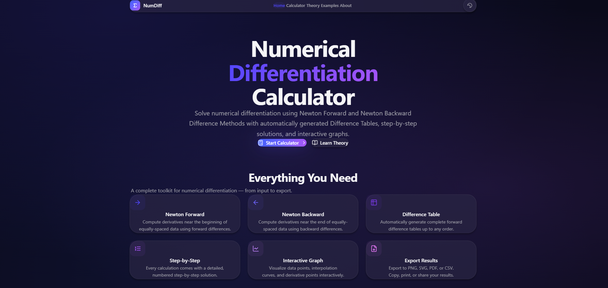

# Numerical Differentiation Calculator

A modern full-stack web application for computing numerical derivatives using **Newton Forward Difference** and **Newton Backward Difference** methods. The application automatically generates Difference Tables, provides step-by-step mathematical solutions with KaTeX-rendered formulas, and visualizes results using interactive graphs.


---

## 🌐 Live Demo

🚀 **Try the application online:**

👉 **https://farhadhridoy.github.io/NumDifCal/**

---

## 📸 Preview



---

## ✨ Features

- ✅ Newton Forward Difference Method
- ✅ Newton Backward Difference Method
- ✅ Automatic Difference Table Generation
- ✅ Step-by-Step Mathematical Solution
- ✅ Interactive Graph Visualization
- ✅ Export Results (PNG, SVG, PDF, CSV)
- ✅ Six Built-in Worked Examples
- ✅ Responsive Apple-inspired UI
- ✅ Dark & Light Theme
- ✅ REST API with Swagger Documentation

---

## 🛠️ Tech Stack

### Frontend

- Next.js 15
- React
- TypeScript
- Tailwind CSS
- Framer Motion
- Recharts
- KaTeX

### Backend

- NestJS
- TypeScript
- Swagger
- Jest

---

## 📖 Mathematical Methods

This project implements numerical differentiation using:

- Newton Forward Difference Formula
- Newton Backward Difference Formula
- Finite Difference Tables
- Higher-Order Forward Differences
- Higher-Order Backward Differences

### Newton Forward Difference

\[
f'(x)=\frac{1}{h}\left[\Delta y_0+\frac{2u-1}{2!}\Delta^2y_0+\frac{3u^2-6u+2}{3!}\Delta^3y_0+\cdots\right]
\]

where

\[
u=\frac{x-x_0}{h}
\]

### Newton Backward Difference

\[
f'(x)=\frac{1}{h}\left[\nabla y_n+\frac{2u+1}{2!}\nabla^2y_n+\frac{3u^2+6u+2}{3!}\nabla^3y_n+\cdots\right]
\]

where

\[
u=\frac{x-x_n}{h}
\]

---

# 🚀 Getting Started

## Prerequisites

- Node.js 18+
- npm 9+

Download Node.js from:

https://nodejs.org

---

## Clone Repository

```bash
git clone https://github.com/FarhadHridoy/NumDifCal.git

cd NumDifCal
```

---

## Backend Setup

```bash
cd backend

npm install

npm run start:dev
```

Backend:

```
http://localhost:3001
```

Swagger Documentation:

```
http://localhost:3001/api/docs
```

---

## Frontend Setup

```bash
cd frontend

npm install

npm run dev
```

Frontend:

```
http://localhost:3000
```

---

## Run Tests

```bash
cd backend

npm test
```

---

# 📁 Project Structure

```
NumDifCal
│
├── backend/
│   ├── src/
│   │   ├── calculator/
│   │   ├── controllers/
│   │   ├── services/
│   │   ├── dto/
│   │   └── interfaces/
│   └── test/
│
├── frontend/
│   ├── app/
│   ├── components/
│   ├── hooks/
│   ├── lib/
│   └── types/
│
├── preview.png
└── README.md
```

---

# 🔌 REST API

| Method | Endpoint | Description |
|---------|----------|-------------|
| POST | `/api/newton-forward` | Compute Forward Difference derivative |
| POST | `/api/newton-backward` | Compute Backward Difference derivative |
| POST | `/api/difference-table` | Generate Difference Table |
| GET | `/api/examples` | Retrieve Worked Examples |
| GET | `/api/health` | Health Check |

---

# 🎨 UI & UX

Designed with modern UI principles inspired by Apple's Human Interface Guidelines.

- Glassmorphism Design
- Responsive Layout
- Dark & Light Mode
- Smooth Animations
- Framer Motion
- Interactive Charts
- Modern Typography

---

# 🧪 Testing

The backend includes comprehensive Jest tests covering:

- Mathematical Accuracy
- Difference Table Generation
- Input Validation
- Duplicate Detection
- Decimal Inputs
- Edge Cases
- Invalid User Inputs

---

# 📦 Deployment

### Frontend

The frontend is deployed on **GitHub Pages**.

🔗 **Live Website**

https://farhadhridoy.github.io/NumDifCal/

---

### Backend

The backend can be deployed to services such as **Render**, **Railway**, or any Node.js hosting platform.

Example environment variable:

```
NEXT_PUBLIC_API_URL=https://your-backend-url.com
```

---

# 🎯 Project Objectives

This project was developed to:

- Learn Numerical Differentiation algorithms
- Implement Newton's Difference Methods
- Build a modern full-stack web application
- Provide an educational tool for students studying Numerical Methods

---

# 👨‍💻 Author

**Farhad Islam**

Computer Science & Engineering

GitHub: https://github.com/FarhadHridoy

---

# ⭐ Support

If you found this project helpful, please consider giving it a ⭐ on GitHub.

Your support is greatly appreciated!

---

# 📄 License

This project is licensed under the **MIT License**.
